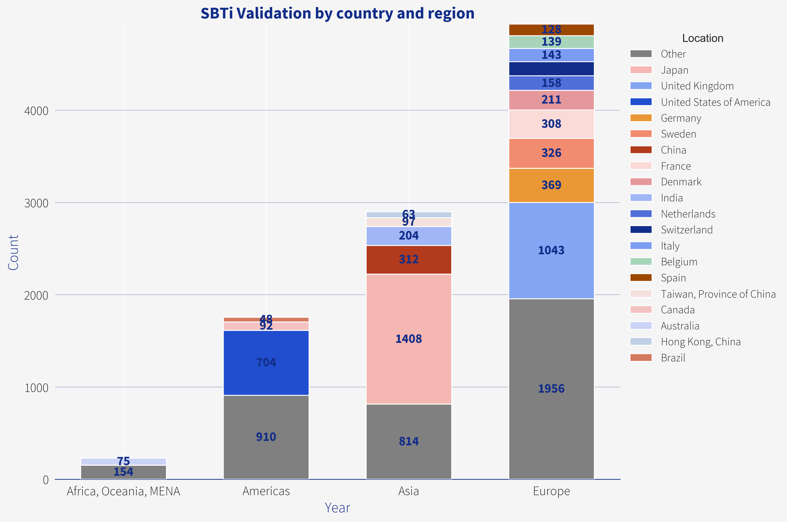
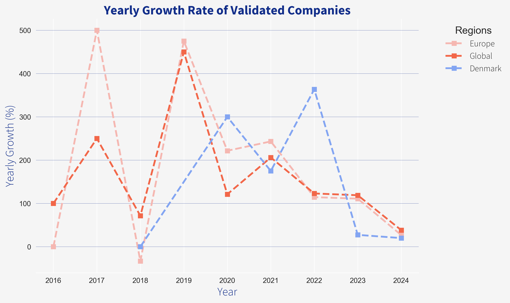
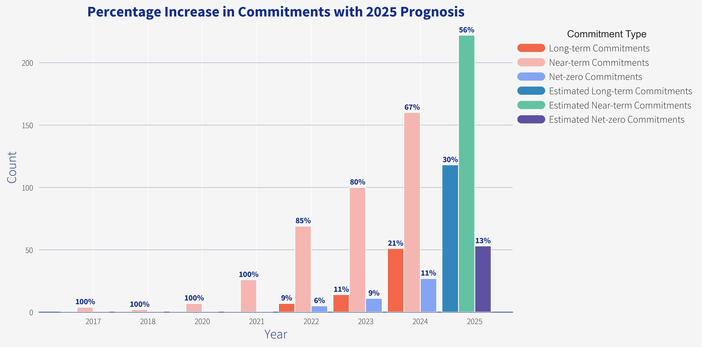

# Executive summary
The Science-Based Target Initiative (SBTi) allows companies to set and commit to emission reduction targets. The companies and targets they set for themselves is made available online by the SBTi, and analysed on this website.

The following sections will follow the problem being solved by the SBTi, how it's popularity has grown in the world, by region, locations, sectors and types of targets. The global, european and danish averages of commitment are compared, and in the main section there is a deep dive into the Danish SBTi commitments.

The popularith of the SBTi has grown rapidly from 2015 to end of year 2024, from 1 to over 10 thousand commitments to reduce greenhouse gas (GHG) emissions. Most targets have been set in Europe, although the most prolific country is currently Japan with more than 1400 commitements. The professional services, construction, technology and consumer product sectors are those who are most commited to pulling the wagon toward an environmentally friendly future - with coal mining, oil and gas sectors in the bottom.

Danish commitements currently make up 2% of SBTi's total with some of the most known groups being the first movers in 2017. In 2024 there was a 68% growth in commitments in Denmark, with a rough estimate of 8 million metric ton CO2eq reduction by 2030 based on scope 1&2 targets. Following this trend of growth, the danish government's legally binding target of 70% emission reduction in comparison to 1990, is still likely to be met.

There has been some contriversy toward the work done by SBTi and yet, by having a business centered target commitment strategy, the SBTi has helped companies to structure their environmental committments all around the world.

Content
1. [Context and climate change](#chapter-1)
2. [Science-Based Target's in a nutshell](#chapter-2)
3. [SBTi in Denmark vs Europe vs Global](#chapter-3)
4. [SBTi in Denmark](#chapter-4)
5. [Scrutiny toward SBTi
   Abbreviations and jargon](#chapter-5)

# Context and climate change {#chapter-1}
In the year 2025, practically all humans have heard about climate change. People do not always agree on its severity or urgency but there is a consensus amongst scientists that the changes are happening and that they are manmade i.e. caused by human industries and ways of living. The changes observed range from local pollution, ocean temperature, salinity and acidification, atmospheric chemical composition to ecosystem collapse and biodiversity extinction. In fact, these changes were observed as early as the 1970s, yet in 2025 people don't have the clarity of the emissions they cause to be able to make decisions to support sustainable change.

If you are a human that has ever worried about climate change you might have already asked yourself, what can I do? You might even have gone into action and done some research on where your emissions come from and whether you can find alternative solutions to your habits. Through this research you probably also realized that this is complicated because companies will try to make themselves look better than they are - and not always because they want to trick you but because they don't know themselves any better.

The problems that most companies have been facing the last years have been:
- They didn't know if or how much they were contributing to climate change
- They didn't know how to reduce emissions of their operations
- They didn't know how to set realistic, science-based targets and how to talk about them

# This is where the Science-Based Target Initiative comes in {#chapter-2}
Science-Based Target Initiative (SBTi) is an organization that allows companies and financial institutions to set and commit to emission reduction targets. The SBTi establishes and advocates for best practices in reducing emissions and setting net-zero targets, aligning with climate science.  The organization creates standards, tools, and guidance to help companies and financial institutions set science-based targets informed by the latest climate research and helps aligning these targets to the goals set by the Paris agreement. Additionally, SBTi Services evaluates and verifies targets set by businesses and financial institutions.

The SBTi collects information about company's targets and making them available on their [website](https://sciencebasedtargets.org/) for transparency. The data used for this analysis has been collected from the SBTi website and is available in two formats:
1. By Companies - represents the commitments made on a company basis (in March 2025: 1.6 MB, 10890 rows with 10 columns)
2. By Targets - is a collection of targets and the details thereof (in March 2025: 2.9 MB, 17169 rows with 7 columns)

In the next few chapters this data is analyzed in terms of growth and popularity of the SBTi, the regulations that helped boost the organization, as well as what countries and industries are putting forward their commitments. Thereafter, the focus will switch over to Denmark, what companies were the first movers, what industries are dominating - and what companies should be there but aren't and who has retracted targets.

The SBTi started helping companies committing to emissions reduction targets in 2015, starting with a Belgian company called Thalys.

Key statistics dashboard

1. Total companies with SBTi targets validated by the SBTi by the end of 2024
2. Increase in the number of companies with SBTi targets by the end of 2024 compared to 2023
3. Nr of companies set SBTi targets for the first time in 2024
4. Increase in companies with net-zero targets in 2024
5. Total accumulative expired targets
6. Total companies that have retracted their targets

As of 2025, over 10 thousand companies worldwide has either committed to or set science-based emissions reduction targets validated by the SBTi. The SBTi, however, wasn't popular from the start and is done on a voluntary basis, meaning that these 10 thousand companies have registered without there being a specific regulation that promotes the SBTi.

In 2024 the commitments to SBTi grew by 81% in comparison to 2023, 867 of which set net zero targets for themselves, meaning companies have set out to [achieve atmospheric balance by balancing out their emission with removals of Greenhous Gas (GHG) emissions (also called climate offsets) over a specified period](https://plana.earth/academy/what-is-difference-between-carbon-neutral-net-zero-climate-positive).

[Expired targets refers to](https://sciencebasedtargets.org/blog/commitment-compliance-policy-what-you-need-to-know) an expired commitment time frame and means that a company needs to commit to new targets. Retracted or withdrawn targets on the other hand refers to a target that either has been withdrawn by the company due to insufficient follow up to their commitments or, simply that the company has decided they will not follow their targets. Currently, 0,32 % of companies have retracted their targets.

The popularity of SBTi has grown at an astounding rate, from 58 in 2019 to over 10 thousand in 2025. Initially, this growth was solely due to corporations but since 2020 small and medium enterprises (SME) gained ground and became equally engaged in number of commitments. Although financial institutions are not overly represented among the companies in the data their participation is important, and according to SBTi, [the key to unlocking the system-wide change needed to reach a net-zero global economy](https://sciencebasedtargets.org/sectors/financial-institutions). Through financial institution's commitments they will have to reduce the emissions of their portfolios, meaning that their lending, investments and other capital market activities, will be consistent with the Paris agreement.

To be able to be SBTi validated companies must apply, go through a validation process where their GHG accounting is audited, their targets need to be defined, reduction initiatives outlined and aligned with the Paris agreement's goals. The SBTi supports these companies in setting the right targets based on their GHG books and, if deemed reasonable, [approved](https://sbtiservices.com/services/corporates_fi). The process is extensive and time-consuming and therefore validations has a slight delay which gives an insight into its growth in popularity. As mentioned before, the SBTi validated its first company in 2015, and thereafter companies have been fighting to register for their commitments to be validated and publicly available.

The SBTi is most popular in the European region, followed by Asia and the Americas (North America, Latin America and the Caribbean). The country with the most commitments is Japan with 1408 commitments, which is more than other Asian countries combined. In Europe however, the UK, Germany, Sweden, France and Denmark hold the top 5 seats by number of commitments. When we look at the most commitment happy sectors, the top 5 are Professional services, Construction, Technology, Consumer Product and Manufacturing. These sectors are therefore likely to drive the sustainable change in Europe, influencing neighboring regions and sectors.

The sectors that are least engaged with the SBTi are the pharmaceutical sector, coal mining and gas utilities sector. Although the participation of Coal and Gas would be beneficial to the initiative, the companies in these sectors would most likely need to go through substantial shifts to be able to realistically contribute to the lowering of emissions.

The SBTi is founded, funded and partnered in the right circumstances, offering support to businesses that makes business sense - [increasing brand reputation, giving investor confidence, making businesses resilient against regulations, increases innovation toward optimization, driving bottom line savings and giving competitive edge](https://sciencebasedtargets.org/blog/six-business-benefits-of-setting-science-based-targets). Given that this is correct one would assume that retracting targets would decrease brand reputation, reducing investor confidence and reduce competitive edge.

## SBTi in Denmark vs Europe vs Global {#chapter-3}
Having established the regional and country popularity of the SBTi it is clear that Danish companies have contributed to the popularity. However, it is not clear what the relative popularity is in Denmark in comparison to European and Global averages.

The graph shows the total validated companies in Denmark, Europe and Globally given there are a million companies in Denmark, Europe and Global. The graph shows clearly that SBTi commitments are popular in Denmark relative to both European and Global companies. The amount of companies in Denmark is sourced from [Danmarks Statisktik](https://www.dst.dk/da/Statistik/nyheder-analyser-publ/nyt/NytHtml?cid=48768). The amount of European companies are gathered from three source: 1. [Eurostat](https://ec.europa.eu/eurostat/statistics-explained/index.php?title=Business_demography_statistics), 2. [Statista](https://www.statista.com/topics/10032/companies-in-russia/#topicOverview) and 3. [Department for Business, Energy & Industrial Strategy](https://www.gov.uk/government/statistics/business-population-estimates-2022/business-population-estimates-for-the-uk-and-regions-2022-statistical-release-html). Finally, the data for the amount of companies globally is gathered from [Demandsage](https://www.demandsage.com/business-statistics/).

However, Danish companies had a different growth rate than the european and global trajectory.

While European and Global companies rushed to committ their targets in 2017 and 2019, the danish companies first got real about validating their targets in 2020. This dip in growth rate could maybe be explained by the overload of the SBTi those years (compared to their competences at that time), or that the Danish companies did not jump on the newest trend until the SBTi had shown promise.

# SBTi in Denmark {#chapter-4}
Danish companies started committing to the SBTi in 2017 with the first company being Carlsberg group which was quickly joined by Rockwool Group, The Velux Group and Vestas Wind Systems.

Key statistics dashboard Denmark
1. Total companies with SBTi targets validated by the SBTi by the end of 2024 DK
2. Increase in the number of companies with SBTi targets by the end of 2024 compared to 2023 DK
3. Nr of companies set SBTi targets for the first time in 2024, DK
4. Increase in companies with net-zero targets in 2024, DK
5. Total accumulative expired targets, DK
6. Total companies that have retracted their targets, DK

By 2025, a staggering 257 Danish companies have committed to the SBTi with a 68% increase in 2024 or 104 new commitments.

The most substantial growth in SBTi commitments in Denmark was made in 2022, with an impressive 400% increase in submissions between years. The growth of commitments that year was mainly due to the contributions of SMEs, who follow a similar trend in Denmark as it does for the total commitments on the SBTi.

To set a target the companies need to define what part of their emissions they are refering to, how much they intend to reduce and by what year. Most companies use the GHG protocol for their corporate emissions accounting which categorises emissions into scopes 1, 2 & 3 which is normally used to define what part of a company's emissions is referd to. The quantity of reduction is set in percentages, based on a baseline year measurement of GHG emissions and tied to a target year, by which time a target should be reached. Near term targets is then a term used for targets set for the near future (typically 2030) and long term for goals (typically 2050). Looking at Danish company targets, it is most common that companies set near term targets amounting to 30 to 60% and long term targets at 85 to 95%.

The Danish government has set a target to [reduce their domestic emissions by 70% in 2030 in comparison to 1990 and reach climate neutrality by 2050](https://klimaraadet.dk/en/analysis/denmarks-climate-targets). Both of these targets have been made legally binding. However one might ask, what are the industries & which company types are those who are going to carry this reduction?

Looking at the Danish commitments from a sector view, we can see that the construction industry, consumer products, food and beverage and retail sectors are the ones that openly plan to reduce the emissions of Denmark.

According to [the Danish climate program on 2024](https://www.kefm.dk/Media/638632332369380008/Klimaprogram%202024%20-%20Digital.pdf), the sectors for which a emissions reduction plan has been made are the energy, industry, waste, transport and agriculture. Although these sectors are categorized differently from the companies in SBTi, there is one obvious difference and that is that the energy sector has not publicly committed their reduction targets through SBTi. In fact, out of the 6 companies registered in this sector, one has retracted targets, namely Clever. Additionally, companies that are noticeably missing are Energi Danmark and Andel Holding A/S, the owner of Clever.

Clever is a company that specializes in the charging of electrical vehicles in Denmark. On Clever’s [website](https://clever.dk/vaerd-at-vide/clevers-baeredygtighedsarbejde) there is a proud mention of their commitment to the SBTi, which seems odd given that there is no longer a commitment associated with the company’s practices. When Clever was asked about the discrepancy (by the authors of this report), they responded that they had not managed to upload their data before the deadline given by SBTi in resulting in a removed status. Clever simultaneously declares that their ambition for emission reduction are unchanged.

<embed type="text/html" src="../assets/images/scope_trend_plot.html" style="width: 100%; max-width: 700px; height: 500px;">

To be able to declare the total emissions that the Danish SBTi targets could reduce, there would be a need to go through the companies' annual reports. Luckily, this has already been done in the Danish SBTi progress report for 2023. The report estimates that the sum of baseline years (only counting scope 1&2) for Denmark amount to 9 million tons of CO2eq with an estimated scope 1 & 2 reduction of 5.1 million metric tons of CO2eq by 2030, corresponding to a 57% reduction from baseline year [see report](https://static1.squarespace.com/static/5c8265907d0c91092007f8cf/t/65522a4eaed01f0ac05bd6cd/1699883605436/Rapport+SBTi.pdf). Given that this reduction would be realized, Denmark would exceed the 1,5C requirement of the Paris agreement. Now, if we assume the same average emission reduction of 2030 scope 1&2 targets and forecast based on the 61% increase in those targets in 2024, we can roughly estimate a 8 million metric ton of CO2eq reduction by 2030.

Putting this into context using the analysis of the [Danish Climate program for 2023](https://klimaraadet.dk/sites/default/files/node/field_files/Denmark%E2%80%99s%202035%20Climate%20Target%20.pdf), 8 million metric tons CO2eq reduction is around 3 million tons short of the projected plan to reach 70% reduction by 2030, and more danish companies comitting to the SBTi every year - and others that are reducing emissions without committing to the SBTi.

According to the development of danish commitments, it can be prediced that there will be a general increase in commitments again this year (2025), especially an increase in long term and net zero targets.

The SBTi has a strong foundation in Denmark with a projected the rapid growth of commitments, an increased focus of Danish companies to engage with their supply chain will have a positive influence on goals of the Paris agreement.

# SBTi scrutiny - Conclusion {#chapter-5}
There are plenty of players that have been critical toward SBTi and for good reasons. The so called "science-based" methods of the target setting has been commented on, as well as their reliance on the GHG protocol and lack of resources when it comes to monitoring after companies have set their goals. Additionally, there was a controversy around the organisation when they published that they would be evaluating carbon offsetts as emission reduction in 2024, that was then retracted a few months later. Although, there are many flaws with the Science-Based Target initative, but in the current maturity of the climate industry and compared to the alternative of not having a business centered target commitment strategy, the SBTi has helped companies to structure their environmental committments all around the world.

# Abbreviations and jargon
GHG - Greenhouse gases
Scope 1, 2 & 3 are defined by the GHG protocol, for more information please visit [their website](https://ghgprotocol.org/) 
Net zero emissions are described in detail by several sources, SBTi being one of them [see their website](https://sciencebasedtargets.org/blog/net-zero-jargon-buster-a-guide-to-common-terms)

# References
1. Bernoville, Tara. 2023. What is the difference between carbon-neutral, net-zero and climate positive?. Plan A. Gathered in April 2025 from: https://plana.earth/academy/what-is-difference-between-carbon-neutral-net-zero-climate-positive
2. Clever. 2025. Clevers arbejde med bæredygtighed. Gathered in May 2025 from: https://clever.dk/vaerd-at-vide/clevers-baeredygtighedsarbejde
3. Danmarks Statistik. 2022. I 2022 var der 417.000 aktive firmaer. Gathered in May 2025 from: https://www.dst.dk/da/Statistik/nyheder-analyser-publ/nyt/NytHtml?cid=48768
4. Demandsage. 2024. 106 Business Statistics For 2025 (Updated Data). Gathered in May 2025 from: https://www.demandsage.com/business-statistics/
5. Department for Business, Energy & Industrial Strategy. 2022. Accredited official statistics: Business population estimates for the UK and regions 2022. Gathered in May 2025 from: https://www.gov.uk/government/statistics/business-population-estimates-2022/business-population-estimates-for-the-uk-and-regions-2022-statistical-release-html
6. E. Segel and J. Heer, "Narrative Visualization: Telling Stories with Data," in IEEE Transactions on Visualization and Computer Graphics, vol. 16, no. 6, pp. 1139-1148, Nov.-Dec. 2010, doi: 10.1109/TVCG.2010.179
7. Eurostat. 2023. Statistics Explained: Business Demography statistics. Gathered in May 2025 from: https://ec.europa.eu/eurostat/statistics-explained/index.php?title=Business_demography_statistics
8. Galvin, Dexter. 2018. Six business benefits of setting science-based targets. Science based targets initiative. Gathered in April 2025 from: https://sciencebasedtargets.org/blog/six-business-benefits-of-setting-science-based-targets
9. Greenhouse gas protocol. 2025. Home: We set the standards to measure and manage emissions. Gathered in May 2025 from: https://ghgprotocol.org/
10. Klima-, Energi- og Forsyningsministeriet. 2024. Klimaprogram 2024. Gathered in April 2025 from: https://www.kefm.dk/Media/638632332369380008/Klimaprogram%202024%20-%20Digital.pdf
11. Peter Mollgaard, Jette Bredahl Jacobsen, Niels Buus Kristensen, Jorgen Elmeskov, Bente Halkier, Per Heiselberg, Marie Trydeman Knudsen, Poul Erik Morthorst & Katherine Richardson. 2022. Denmark's Climate Targets. Danish Council on Climate Change. Gathered in April 2025 from: https://klimaraadet.dk/sites/default/files/node/field_files/Denmarks%20Climate%20Targets%20-%20English%20policy%20brief.pdf
12. Røge, L. R., Riis, A. M., Vindbjerg, M. & Christensen J. M. 2023. Commitment to the Science-based Targets Initiative (SBTi) in Denmark: A prograss report in the lead-up to COP28. Gathered in May 2025 from: https://static1.squarespace.com/static/5c8265907d0c91092007f8cf/t/65522a4eaed01f0ac05bd6cd/1699883605436/Rapport+SBTi.pdf
13. SBTi services. 2025. Target Validation Services. Gathered in April 2025 from: https://sbtiservices.com/services/corporates_fi
14. Science based targets initiative. 2025. Financial Institutions. Gathered in April 2025 from: https://sciencebasedtargets.org/sectors/financial-institutions
15. Science based targets initiative. 2025. Home: Ambitious corporate climate action. Gathered in April 2025 from: https://sciencebasedtargets.org/
16. Science based targets initiative. 2022. Commitment Compliance Policy - what you need to know. Gathered in April 2025 from: https://sciencebasedtargets.org/blog/commitment-compliance-policy-what-you-need-to-know
17. Statista. 2024. Companies in Russia - statistics & facts. Gathered in May 2025 from: https://www.statista.com/topics/10032/companies-in-russia/#topicOverview
18. The Danish Council on Climate Change. 2024. Denmark's 2035 Climate Target: 10 questions and answers regarding a forthcoming 2035 Climate Target. Gathered in May 2025 from: https://klimaraadet.dk/sites/default/files/node/field_files/Denmark%E2%80%99s%202035%20Climate%20Target%20.pdf

